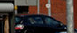
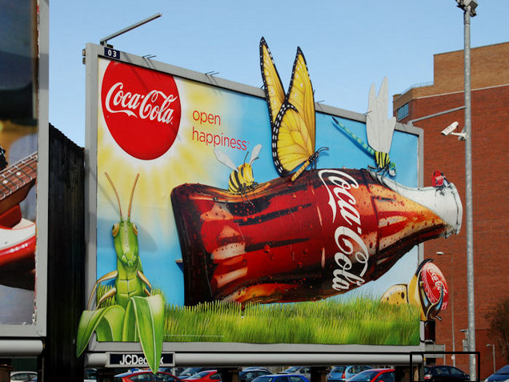
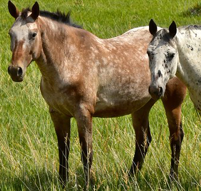
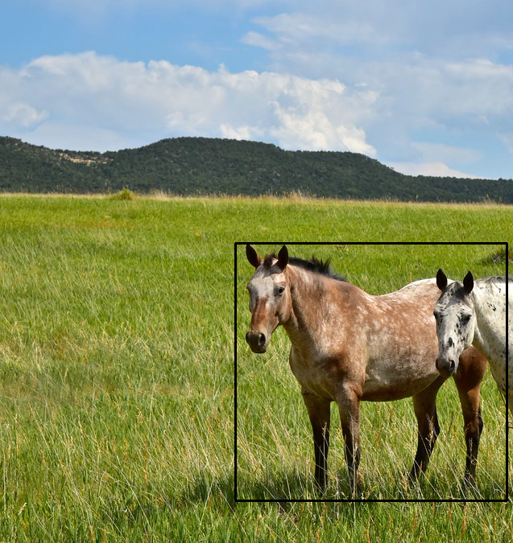
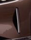

# computer-vision

[](https://app.codacy.com/gh/lurkydismal/computer-vision/dashboard?utm_source=gh&utm_medium=referral&utm_content=&utm_campaign=Badge_grade)

> Simple image-on-image search project.

## Table of Contents

* [Technologies Used](#technologies-used)
* [Features](#features)
* [Screenshots](#screenshots)
* [Setup](#setup)
* [Usage](#usage)
* [Project Status](#project-status)
* [Room for Improvement](#room-for-improvement)
* [License](#license)

## Technologies Used

* OpenCV - version 4.5.4
* fmt - version 8
* stringr - version 1.4.1
* Rcpp - version 1.0.11

## Features

* Crossplatform ( X11 based desktop environments, Windows ).
* Reading image from both file or window.
* Mouse clicks and movement.

## Screenshots

* > Template:
  > 
  > Sample:
  > 

* > Template:
  > 
  > Sample:
  > 

* > Template:
  > 
  > Sample:
  > 

## Setup

* > OpenCV for **Debian/ Ubuntu**:
  > ``` console
  > apt install libopencv-dev
  > ```

  > Other platforms:
  > [_OpenCV Releases_](https://opencv.org/releases/)

* > fmt library for **Debian/ Ubuntu**:
  > ``` console
  > apt install libfmt-dev
  > ```

  > Other platforms:
  > [_fmt library_](https://github.com/fmtlib/fmt/releases/latest)

* > R stringr package:
  > ``` r
  > install.packages("stringr")
  > ```

* > R Rcpp package:
  > ``` r
  > install.packages("Rcpp")
  > ```

## Usage

> Change `window_name` in **src/main.r**.
> Put images into **./image** folder.
> Image name example:
> for _sample_ is **"sample.category_name.png"**
> for _template_ is **"template.category_name.unique_name.png"**
> Run **./run.sh**

**The image you are looking for should have the same size on sample as on template.**

## Project Status

Project is: _in progress_.

## Room for Improvement

Room for improvement:

* Improve RAM usage.
* Make search for template independent from sample scale.

To do:

* Add GPU as an option.
* Add regular expression support for Windows.

## License

This project is open source and available under the [GNU General Public License v3.0](https://github.com/lurkydismal/computer-vision/blob/main/LICENSE).
